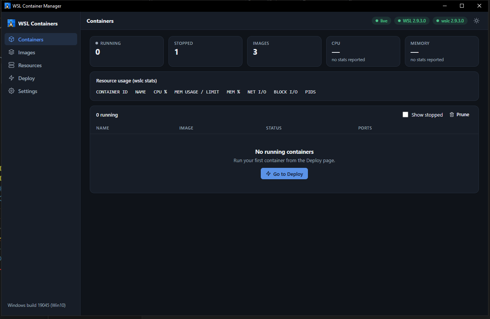
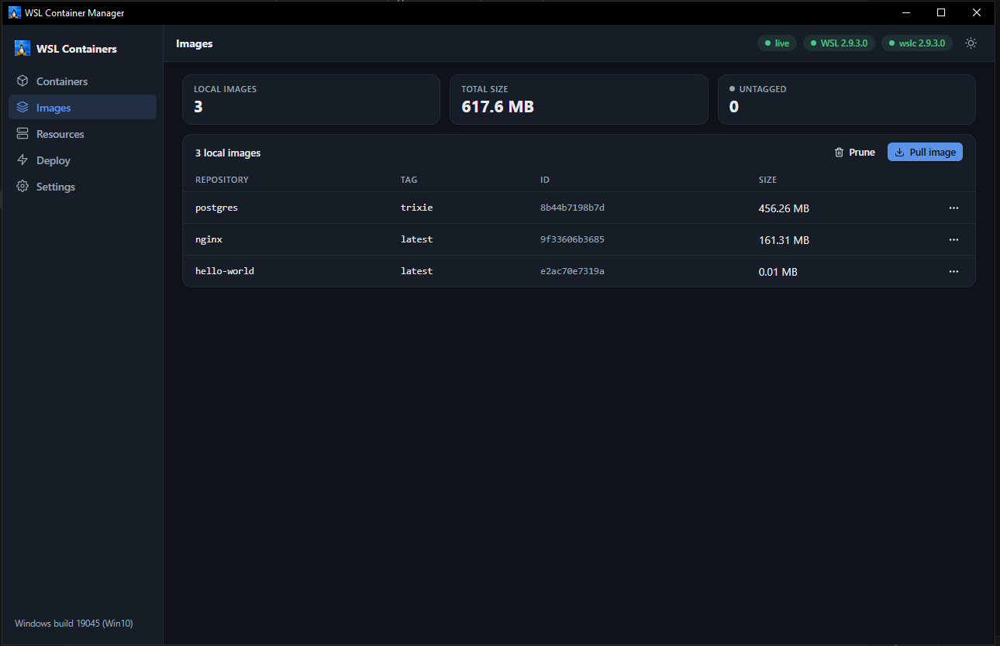

<div align="center">

# WSL Container Manager

**A Docker-Desktop-style GUI for WSL containers — that never lies to you about what it can do.**

[](https://github.com/TykoDev/wslc-gui/actions/workflows/build.yml)
[](LICENSE)
[](#requirements)
[](https://deno.com)
[](docs/guides/run-tests.md)

[**Documentation**](docs/index.md) · [**Install**](docs/getting-started/01-installation.md) · [**Architecture**](docs/concepts/architectural-overview.md) · [**Security**](docs/concepts/security-model.md) · [**Contribute**](CONTRIBUTING.md)


</div>

---

## What it is

`wslc-gui` puts the native `wsl.exe` and `wslc.exe` command surface behind one GUI: containers,
images, distributions, storage, deployment, and a guided `.wslconfig` editor.

It ships as **a single ~80 MB executable.** No installer. No runtime dependencies beyond the
WebView2 that Windows already has.

### The problem it solves

WSL now runs containers natively through `wslc` — no Docker Desktop, no licence, no daemon. But
the only interface is a CLI whose surface is still moving: some verbs are documented, some exist
only in the binary, and what you get depends on which WSL build you happen to have.

So you end up with a terminal, a lot of `--help`, and no idea whether the thing you're about to
type exists on your machine.

### The idea that makes it different

> **The app invents no commands.**

Every button maps to a CLI invocation that Microsoft documents, or that **your** installed `wslc`
binary has proven it supports by printing it in `--help`. Nothing is guessed. Nothing is emulated.

That has real consequences you can see:

- A verb your `wslc` build doesn't have is a **greyed-out button that tells you which verb it
  needs** — not a mysterious failure.
- A compose file that asks for something `wslc` can't do gets **an itemised list of exactly what
  was dropped and why** — not a silent partial deploy.
- Volumes have **no size column**, because `wslc volume inspect` doesn't report one and we won't
  invent a number.
- Every failure shows you the **real `stderr`**, verbatim.

**It is for developers on Windows who want their containers managed without a black box in the
middle.**

---

## Key features

- **Containers** — list, stop, start, delete, logs, inspect, exec, prune, with live `wslc stats`
  (CPU and memory joined straight into the table).
- **Deploy** — Quick run with a **live command preview** that shows the exact `wslc run` line
  before you commit to it; plus Stack mode, which compiles a compose-subset YAML into an ordered
  plan, shows it, deploys it sequentially, and exports standard `docker-compose.yaml`. **Imports
  docker-compose and Kubernetes manifests** — and tells you, item by item, what it couldn't
  honour.
- **Resources** — distributions (resize, move, export, import, sparse, unregister), real
  `ext4.vhdx` paths and sizes read from the registry, container-session disks, swap, volumes.
  **This page works fully even with no `wslc` installed.**
- **Settings** — a guided `.wslconfig` editor with the full documented key catalogue,
  Windows-11-only keys disabled *with the reason shown* on Windows 10, and a backup taken before
  every write.
- **Honest by construction** — capability-gated verbs, `stderr` passed through verbatim,
  double-gated destructive operations, and a security model built for the fact that
  **a loopback server that can delete your distro is a real attack surface.**

---

## Screenshots

### Deploy — the command preview *is* the command

Nothing is hidden. The exact `wslc run` line assembles as you type, and **that is what gets
executed.** Docker Desktop hides the command it runs; this shows you the argv before you press
the button.

[](docs/assets/deploy.png)

### Containers — live `wslc stats`, joined into the table

CPU and memory come from `wslc stats`, parsed and merged into the rows. When `wslc` reports no
stats, the tiles say **"no stats reported"** rather than showing you a zero.

[](docs/assets/containers.png)

### Resources — real paths, real sizes, no `wslc` required

Distribution `ext4.vhdx` paths and sizes read straight from the registry, `wslc` container-session
disks, swap, and volumes. **This page works fully on a host with no `wslc` at all.**

[](docs/assets/resources.png)

### Images — pull with tag discovery, inspect, prune

[](docs/assets/images.png)

### Settings — the guided `.wslconfig` editor

Every documented key, with its description and default. Note `safeMode`, greyed out with a
**`Win11`** badge: this is a Windows 10 host, and the app tells you exactly *why* the control is
disabled rather than quietly hiding it.

[](docs/assets/settings.png)

---

## Requirements

| | |
| --- | --- |
| **Windows** | 10 build 19041+ (some `.wslconfig` keys are Windows 11 only — shown, disabled, with the reason) |
| **WSL 2** | Required. The container pages additionally need a WSL release that ships `wslc` — check with `wslc version`. Without it, the app still runs and Resources/Settings work fully. |
| **WebView2** | Ships with Edge. If missing, the app falls back to your browser rather than failing. |

---

## Getting started

### Just run it

1. Download `wslc-gui.exe` from the [latest release](https://github.com/TykoDev/wslc-gui/releases)
   (or from the [build workflow](https://github.com/TykoDev/wslc-gui/actions/workflows/build.yml)
   artifacts).
2. Double-click it.

That's it. A window opens on the Containers page and a tray icon appears.

<details>
<summary><b>Optional: make the first launch work offline</b></summary>

Drop the two WebView2 DLLs from the
[webview_deno 0.9.0 release](https://github.com/webview/webview_deno/releases/tag/0.9.0) next to
the exe:

```
wslc-gui.exe
dll/
├─ webview.dll
└─ WebView2Loader.dll
```

Without them, the first launch (and only the first) downloads those two files.
</details>

### Build it from source

You need **[Deno 2.9+](https://deno.com/)**. That's the whole toolchain — **no Node.js, no npm.**

```powershell
git clone https://github.com/TykoDev/wslc-gui.git
cd wslc-gui\app

deno task build:web    # SPA → frontend/dist   (must come first — compile embeds it)
deno task compile      # → dist/wslc-gui.exe

.\dist\wslc-gui.exe
```

### Hack on it

Two terminals, from `app/`:

```powershell
deno task dev:server    # API on :8747 — prints a tokened URL
```

```powershell
deno task dev:web       # SPA + HMR on :5173, proxying /api → :8747
```

Open `http://127.0.0.1:5173/#t=<the token from terminal 1>`. You need that fragment — it carries
the session token.

```powershell
deno task test    # 166 tests, ~1 second
```

**There is no `.env` to set up.** Configuration is the GUI (Settings → Application) or
`.wslconfig` (Settings → WSL) — nothing else.

→ Full setup, editor config and troubleshooting:
[**Local development**](docs/getting-started/03-local-development.md)

---

## Your first container

With `wslc` present:

1. **Deploy → Quick run.** Type `nginx:latest`, add a port (`8080:80`).
2. Watch the **command preview** assemble the exact line before you run it:
   ```
   wslc run -d -p 8080:80 --name web nginx:latest
   ```
3. **Run container.** Then open **Containers** — it's there, with live CPU and memory.

No hidden step. That preview *is* the command.

---

## Documentation

**[→ Full documentation](docs/index.md)**

| | |
| --- | --- |
| [Installation](docs/getting-started/01-installation.md) · [Configuration](docs/getting-started/02-configuration.md) · [Local development](docs/getting-started/03-local-development.md) | Tutorials |
| [Build & release](docs/guides/deploying-to-production.md) · [Observe a running instance](docs/guides/setting-up-monitoring.md) · [Run the tests](docs/guides/run-tests.md) · [Plan a change](docs/guides/development-planning.md) | How-to guides |
| [Architectural overview](docs/concepts/architectural-overview.md) · [Security model](docs/concepts/security-model.md) | Explanation |
| [API endpoints](docs/reference/api-endpoints.md) · [Data model](docs/reference/data-model.md) · [Environment variables](docs/reference/environment-variables.md) · [Commands & scripts](docs/reference/commands-scripts.md) · [Dependencies](docs/reference/dependencies.md) · [Docker & Compose compatibility](docs/reference/docker-reference.md) | Reference |

Building on it? Start with [`AGENTS.md`](AGENTS.md) — it's the condensed technical brief, written
for both humans and coding agents.

---

## How it's built

React 19 SPA in a WebView2 window, a Deno HTTP server in a Worker (because `webview.run()` blocks
the main event loop), and **exactly one function in the entire codebase that spawns a child
process** — with a binary allowlist, argument arrays instead of a shell, and every user input
validated at the sink.

<div align="center">
  
</div>

→ [Architectural overview](docs/concepts/architectural-overview.md) ·
[Security model](docs/concepts/security-model.md)

---

## Contributing

Contributions are welcome — from a typo fix to a whole new page. You don't need to be a Deno
expert or a Win32 expert.

**Parsing bugs are especially valuable.** `wsl.exe` and `wslc.exe` output varies across versions,
languages and hosts, and we can't test them all. If a distro name or container table renders
wrong, the raw output is the fix — and it becomes a test fixture.

**Equally valuable:** a paste of `wslc --help` (and `container` / `image` / `run` / `volume`
`--help`) from a WSL version we haven't seen. The capability model is built on exactly that.

→ [**CONTRIBUTING.md**](CONTRIBUTING.md) · [Code of Conduct](CONDUCT.md) · [Changelog](CHANGELOG.md)

**Found a security issue?** Please **don't** open a public issue — see [SECURITY.md](SECURITY.md).

---

## Licence

Licensed under the **GNU General Public License v3.0**. See [LICENSE](LICENSE) for the full text.

```
Copyright (C) 2026 TykoDev

This program is free software: you can redistribute it and/or modify it under the terms
of the GNU General Public License as published by the Free Software Foundation, either
version 3 of the License, or (at your option) any later version.

This program is distributed in the hope that it will be useful, but WITHOUT ANY WARRANTY;
without even the implied warranty of MERCHANTABILITY or FITNESS FOR A PARTICULAR PURPOSE.
See the GNU General Public License for more details.
```

---

<div align="center">
<sub><b>Not affiliated with Microsoft or Docker.</b> <code>wsl.exe</code> and <code>wslc.exe</code> are Microsoft's; this is a GUI in front of them.</sub>
</div>
