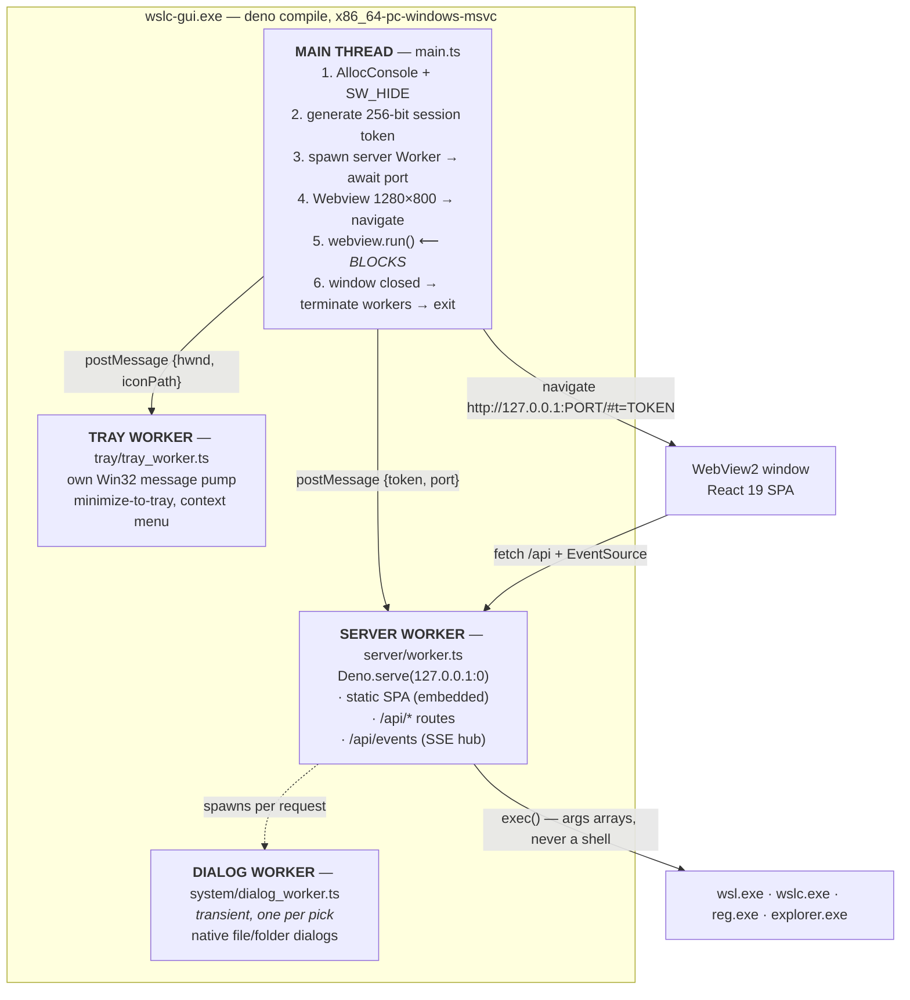
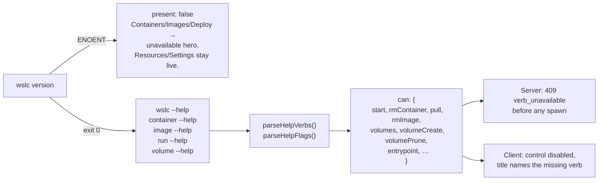
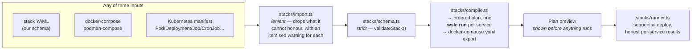

# Architectural overview

This document explains *why* the app is built the way it is. For "what calls what", see the
[API reference](../reference/api-endpoints.md); for "how do I run it", see
[local development](../getting-started/03-local-development.md).

---

## The one idea

> **The app invents no commands.**

Every button is a documented `wsl.exe` or `wslc.exe` invocation, or a verb the installed binary
has *proven* it supports by printing it in `--help`. Nothing is guessed, nothing is emulated,
and when something cannot be done honestly the app says so and disables the control with a
reason.

That single constraint produces almost the entire architecture: the capability model, the
one-choke-point process layer, the drop-with-warning importer, the refusal to show a volume
size that cannot be measured. Read the rest of this document with it in mind and the decisions
stop looking arbitrary.

---

## Process topology

The app ships as one executable that runs **three or four threads**, and the shape is forced by
a single constraint discovered during a spike:

> **`webview.run()` blocks the main JavaScript event loop.** Only FFI callbacks fire while it
> is running.

An HTTP server on the main thread would therefore starve the moment the window opened. So the
server lives in a Worker — which has its own event loop, unaffected by a blocked main thread.



### Why each thread exists

**Main thread** owns the window, because `webview.run()` insists on it. It is blocked for the
entire life of the app, which is why *nothing else* can live there.

**Server worker** owns HTTP, because the main thread is blocked. Its URL must be a static
`new Worker(new URL("./server/worker.ts", import.meta.url))` — a dynamic path would not be
embedded by `deno compile`, and workers are **not** auto-embedded: each one needs an explicit
`--include`.

**Tray worker** owns a hidden Win32 window and its own message pump. It cannot share the main
thread (blocked) and must not block the server worker. It polls `IsIconic` every 250 ms to
implement minimize-to-tray, and talks to the app window only through cross-thread-safe HWND
calls (`ShowWindow`, `PostMessage`).

**Dialog worker** is transient — one is spawned per file/folder pick and closes immediately
after. Native Windows dialogs pump their own modal message loop and **block the calling
thread**, so they may never run on the main thread (blocked) or the server worker (would freeze
every request). The server serialises picks with a single `picking` flag: one dialog at a time,
because each one takes user focus.

### Headless mode

`--headless` skips the webview entirely and runs the server **on the main thread**. This is not
a cosmetic difference: a Worker alone does not keep Deno's event loop alive, but `Deno.serve`
does. Headless serves three purposes — development, rendered-verification, and the automatic
fallback when the WebView2 runtime cannot be loaded.

---

## The token handshake

```
main.ts                     server worker              SPA (WebView2)
   │                              │                          │
   ├── generateToken() ───────────│                          │
   │   32 random bytes → hex      │                          │
   ├── postMessage {token, port} ─▶                          │
   │                              ├── Deno.serve(127.0.0.1:0)│
   ◀── postMessage {ready, port} ─┤                          │
   │                              │                          │
   ├── navigate ──────────────────────────────────────────────▶
   │   http://127.0.0.1:PORT/#t=<token>                       │
   │                              │                    initToken():
   │                              │                    · read location.hash
   │                              │                    · sessionStorage
   │                              │                    · strip the fragment
   │                              ◀── Bearer <token> ────────┤
```

The token travels in the **URL fragment**. Fragments are never sent to a server, never appear in
request logs, and never leave the browser. The SPA reads it once, stores it in `sessionStorage`
(so a reload survives), and immediately rewrites the address bar to remove it.

Every `/api` call then carries `Authorization: Bearer <token>`.

**One exception:** `EventSource` cannot set headers, so `/api/events` — and only `/api/events` —
accepts the token as a `?t=` query parameter. Every other route requires the header, which means
a token that leaked into a copied URL is not a usable credential anywhere else.

---

## Layers

```
┌──────────────────────────────────────────────────────────┐
│  frontend/     React 19 · Vite 7 · react-router          │
│                pages · components · SSE reducer          │
└──────────────────────────┬───────────────────────────────┘
                           │  fetch /api · EventSource
┌──────────────────────────▼───────────────────────────────┐
│  server/       auth · routes · sse · static · app_config │
│                thin handlers: validate → adapter → JSON  │
└──────────────────────────┬───────────────────────────────┘
                           │
        ┌──────────────────┼──────────────────┐
        │                  │                  │
┌───────▼────────┐  ┌──────▼───────┐  ┌───────▼────────┐
│  adapter/      │  │  stacks/     │  │  system/ tray/ │
│  exec ⟵ the    │  │  schema      │  │  Win32 FFI     │
│  ONLY spawn    │  │  import      │  │  dialogs, tray │
│  site          │  │  compile     │  └────────────────┘
│  wsl · wslc    │  │  runner      │
│  wslconfig     │  └──────────────┘
│  registry      │
│  parsers ★     │   ★ = pure, unit-tested
│  validate ★    │
│  capabilities ★│
└────────────────┘
```

**Routes are deliberately thin.** A handler validates, calls an adapter, and shapes an honest
JSON response. It does not spawn processes and it does not contain business logic.

**`adapter/exec.ts` is the only place a child process is created, anywhere in the codebase.**
That is what makes the security model auditable — there is exactly one function to review.

**The starred modules are pure.** No IO, no processes. This is why the test suite can run with
only `--allow-read` and `--allow-env`, and it is the property to preserve when adding code.

---

## The capability model

`wslc` is a moving target. Some verbs are documented. Some exist in the binary but not the docs
(`container start`, `container rm`, `pull`, `image rm`, the whole `volume` lifecycle,
`run --entrypoint`). Some hosts have no `wslc` at all.

The app refuses to guess. **It asks the binary.**



Cached for 60 seconds; `?force=1` bypasses it (that is what the **Re-check** button does after
you run `wsl --update`).

**Both gates always.** The client gate is a courtesy to the user. The server gate is the actual
control — a hand-crafted request body must not be able to make the app emit a flag this `wslc`
build does not understand.

### The degradation promise

On a host with **no `wslc`**: Containers, Images and Deploy show an explicit unavailable state
with a re-check button. **Resources and Settings keep working completely** — distributions,
storage, `.wslconfig`, mount/unmount, WSL versions. The hero screen says so in writing, and the
Volumes card on Resources is *not rendered at all* in that state specifically so nothing
contradicts it.

On **Windows 10**: Windows-11-only `.wslconfig` keys are shown but disabled, with the reason.
Not hidden — you should be able to see what you're missing.

---

## Stacks: compose without compose

`wslc` has **no compose support**. It has `run`. So the Deploy page does the sequencing itself,
and is explicit that this is what it's doing.



The design carries three commitments:

**Lenient in, strict through.** The importer accepts three formats and normalises them into one
strict `Stack` that a single validator guards. New input formats plug in at the front; the
execution path never grows a special case.

**Drop with an itemised warning, never silently.** A compose `build:` key, a UDP port, a k8s
`nodeSelector`, a `configMapRef` that isn't in the file — each produces a specific, named
warning. The UI renders the list **in full, never truncated, never as a toast**. Zero warnings
gets you a green banner saying so explicitly.

The one hard reject: a compose service with `build:` and no `image:`. There is genuinely nothing
to run, so it is a 400 rather than a warning.

**You see the plan before it executes.** The compiled `wslc run` command line for every service
is rendered before the Deploy button does anything. No hidden step.

A stack's containers are named `<stack>-<service>`. Redeploying a stack that dropped a service
carries the old container into the new record flagged `orphaned`, with a warning — and **never
auto-stops it.** A redeploy must not silently kill a container you didn't ask it to.

### Size grammars do not unify

Three targets, three different grammars. Getting this wrong is silent and expensive:

| Target | Grammar | Example | Getting it wrong |
| --- | --- | --- | --- |
| `.wslconfig` | Whole number + `MB`/`GB`, **or** a bare byte count | `memory=4GB` | **`4G` is undocumented. WSL ignores the key and silently uses 50% of RAM.** No error. |
| `wsl --manage --resize` | `<n>B/M/MB/G/GB/T/TB`, **decimals unsupported** | `--resize 100GB` | A decimal is rejected outright. |
| `wslc run -m` / `--shm-size` | docker-style, binary, decimals allowed | `-m 512M` | — |
| Kubernetes `limits.memory` | **decimal** — `512M` is 512 × 10⁶ | `512M` | Docker's `512M` is 512 **MiB**. Converting between them must round *and warn*. |

The app models all four separately. The importer converts k8s decimal units to docker binary
units and **warns when the conversion had to round**. The `.wslconfig` server-side validator
refuses `4G` and `4.5GB` on the structured-edit path — because a value WSL silently ignores is
worse than an error.

Raw-file mode remains the escape hatch. The editor never rewrites a value it cannot model.

---

## Live updates

One SSE stream, five channels, **snapshots rather than deltas** — so client reducers are
idempotent and a dropped frame needs no resynchronisation.

| Channel | Interval |
| --- | --- |
| `containers` | `pollMs` (default 2500 ms, user-configurable) |
| `resources` | 8 s |
| `images` · `volumes` | 30 s |
| `capabilities` | 60 s |
| `:hb` heartbeat | 25 s |

Three properties:

- **Pollers only run while a client is connected.** Close the window and the app stops shelling
  out entirely.
- **A slow probe skips its tick** rather than stacking a second one behind the first.
- **Mutations poke their channel immediately** — you never wait an interval to see the result of
  your own click.

Details in [How to observe a running instance](../guides/setting-up-monitoring.md).

---

## Persistence

There is no database. State is either read live from the system, or kept in two small JSON
files.

| Path | Contents | On corruption |
| --- | --- | --- |
| `%APPDATA%\wslc-gui\config.json` | theme, `pollMs`, `showStoppedDefault` | Renamed `.corrupt.<ts>`, defaults regenerated |
| `%APPDATA%\wslc-gui\stacks.json` | deployed-stack records | Same |
| `%USERPROFILE%\.wslconfig` | **WSL's file, not ours.** Backed up before every write, edited line-preservingly, written atomically (temp + rename) | 5 newest backups kept |

**The app never crash-loops on a bad config file.** Everything is schema-validated on read.

Distro storage is *discovered*, not stored: `reg query HKCU\…\Lxss` gives each distribution's
`BasePath`, and the app `stat`s the real `ext4.vhdx`. Container-session disks are read from
`%LOCALAPPDATA%\wslc\sessions\<name>\*.vhdx` — WSL's own directory, which the app reads and
never writes.

---

## WebView DLL provisioning

`@webview/webview` resolves `webview.dll` and `WebView2Loader.dll` **at module load**, from
`PLUGIN_URL` or — failing that — by downloading them from GitHub. It also copies the loader into
the process's current working directory.

Two problems: the exe may sit in a read-only directory, and a first launch would need network
access.

So `main.ts`, **before** the dynamic import:

1. `chdir`s to `%LOCALAPPDATA%\wslc-gui\runtime` — guaranteed writable.
2. If a `dll\` folder ships next to the exe, points `PLUGIN_URL` at it and pre-places the loader
   in the CWD, so the library skips its download-and-delete cycle entirely.

**With `dll/`: fully offline from the first launch.** Without it: one download, once.

If the webview fails anyway — no WebView2 runtime, DLL load failure — the app does not die
silently. It shows a message box, opens the working URL in the user's browser via `explorer`,
and **keeps the server alive** so that URL resolves. An earlier version kept the server up and
showed *nothing*: an invisible, unreachable process holding a port. That was worse than
crashing.

---

## Related

- [Security model](security-model.md) — the trust boundaries and what defends them.
- [API endpoints](../reference/api-endpoints.md) — every route.
- [Data model](../reference/data-model.md) — every wire type and on-disk shape.
