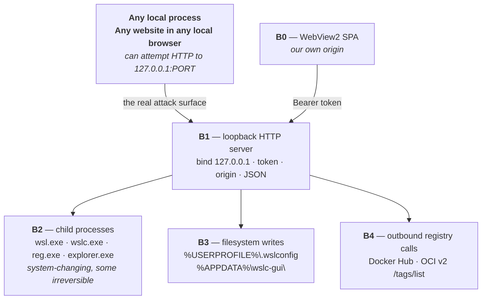

# Security model

The app holds no secrets and serves one local user. It would be easy to conclude that its
security posture doesn't matter much.

That conclusion is wrong, and the reason is worth stating plainly:

> **The app runs a loopback HTTP server whose endpoints delete distributions, shut down the WSL
> VM, and execute arbitrary containers.** Any process on the machine — and *any website open in
> any browser on the machine* — can attempt `fetch("http://127.0.0.1:PORT/api/...")`.

An unauthenticated version of this app would let a random web page destroy your Ubuntu install
via a drive-by request. The controls below are not theatre. They are the reason that isn't
possible.

---

## Trust boundaries



**B1 is where the app is actually attacked.** Everything else is downstream of it.

---

## B1 — the HTTP server

Five controls, layered.

### 1. Bind loopback only

`Deno.serve({ hostname: "127.0.0.1" })`. Never `0.0.0.0`. The request handler *also* rejects any
remote address that isn't `127.0.0.1` — redundant with the bind, and kept anyway.

### 2. A per-launch session token

256 bits from `crypto.getRandomValues`, generated fresh at process start, hex-encoded.

Required on **every** `/api` request. Compared in **constant time** — a length mismatch returns
early, and equal-length strings are XOR-folded so the comparison leaks no timing signal.

Delivered to the SPA **through the URL fragment** (`#t=…`). This matters: fragments are never
transmitted to a server, never written to request logs, never sent to proxies. The SPA reads it
once, moves it to `sessionStorage`, and strips it from the address bar.

**Static assets are token-free** — they contain no secrets, and requiring a token to load the
JavaScript that reads the token would be circular.

### 3. Origin allowlist

If an `Origin` header is present, it **must** equal the server's own origin. Otherwise: **403**.

And the server emits **no `Access-Control-Allow-*` headers, ever.** So:

- A cross-origin *read* is blocked by the browser's own CORS policy.
- A cross-origin *blind write* — the form-POST CSRF shape, which CORS does not prevent — is
  blocked by the 403.

Both halves are needed. Neither alone is sufficient.

### 4. JSON content-type on every mutation

Any non-GET request must carry `Content-Type: application/json`, or it gets **415**.

This kills HTML-form CSRF outright. An HTML `<form>` can only send
`application/x-www-form-urlencoded`, `multipart/form-data` or `text/plain` — it *cannot* set a
JSON content type without a preflight, and a preflight triggers the origin check above.

### 5. The SSE exception, scoped tightly

`EventSource` cannot set an `Authorization` header. So `/api/events` — **and only
`/api/events`** — accepts `?t=<token>`.

Every other route requires the header. That containment is the point: a token that leaks into a
copied URL, a shell history, or a screenshot is not a usable credential for any endpoint that
changes anything.

---

## B2 — process execution

This is where the damage would happen, so it has exactly **one door**.

### One choke point

Every child process in the entire codebase is spawned by `exec()` in
[`adapter/exec.ts`](../../app/adapter/exec.ts). There is no other `Deno.Command` anywhere.

```ts
const BIN_ALLOWLIST = new Set(["wsl", "wslc", "reg", "explorer"]);
```

That allowlist is **mirrored exactly** by the compile-time flag:

```
--allow-run=wsl,wslc,reg,explorer,C:\Program Files\WSL\wslc.exe
```

So the Deno sandbox enforces it *even if application code is wrong*. Two independent layers, and
the outer one does not depend on the inner one being correct.

### Never a shell

Argument **arrays** only. No `cmd /c`. No `powershell -c`. No string concatenation into a
command line, anywhere. There is no shell to inject into.

### Validate at the sink

Every user-influenced argument passes through
[`adapter/validate.ts`](../../app/adapter/validate.ts) before it reaches `argv`:

| Input | Rule |
| --- | --- |
| Names | `^[A-Za-z0-9][A-Za-z0-9_.-]*$`, ≤128 |
| Image refs | `^[a-z0-9][a-z0-9._\-/:@]*$`, ≤256, no `//`, no `..` |
| Ports | integers 1–65535 |
| Windows paths | absolute, drive-letter form, no `..` |
| Container paths | absolute, no `..` |
| Env pairs | `KEY=value` |
| Command tokens | ≤64 tokens, ≤512 chars each, no NUL/CR/LF |

And the one that matters most:

> **Any argument beginning with `-` is rejected.**

That is the flag-injection defence. Without it, a container named `--privileged` — or an image
ref of `-v/:/host` — becomes a *flag* rather than a *value*. The base validator refuses a leading
dash before any specific rule runs.

It applies even to strings that came **from `wslc`**. `listVolumes()` re-validates the names
`wslc` just gave it before feeding them back into a `volume inspect` argv. A name that fails is
still *shown* — it exists, and the list is the truth about that — but is never *emitted* as an
argument. Filtered, not thrown on: one strange name must not blank the user's whole volume list.

### Timeouts on everything

Every child has a timeout and is killed when it expires (10 s default, up to 1800 s for
`wsl --install`). No zombie accumulation.

### Destructive operations are double-gated

**A UI confirmation is never the only gate.** The server requires its own echo in the body:

| Operation | Server requires |
| --- | --- |
| `DELETE /api/distros/:name` | `{"confirmName": "<the exact distro name>"}` |
| `POST /api/wsl/shutdown` | `{"confirm": true}` — and returns the running distro list if you omit it |
| `POST /api/volumes/prune` | `{"confirm": true}` |

A compromised renderer, or a hand-crafted request, cannot skip these. **No configuration flag
can disable them.** The UI additionally demands a typed name for unregister and the literal word
`prune` for volume pruning — but that is a courtesy on top of the real control, not the control
itself.

### Never fabricate success

A nonzero exit becomes **502** carrying the real `exitCode`, `stderr` and `stdout`. The `stderr`
is passed through **verbatim** — never summarised, never re-executed, never interpolated into
anything.

---

## B3 — filesystem writes

### `.wslconfig`

This is the user's file, and the app treats it as such.

1. **Backup first** — `%USERPROFILE%\.wslconfig.bak.<timestamp>`, five newest kept.
2. **Write atomically** — to `.wslconfig.tmp`, then `rename` over the real file. On NTFS that is
   atomic, so a crash mid-write cannot leave a half-written config.
3. **Preserve everything you didn't touch** — line-preserving edits. Comments, blank lines, and
   keys the app has never heard of all survive. Only edited keys change.
4. **Validate against the catalog** — an unknown `section.key` is a 400.
5. **Guard the size grammar** — `4G` and `4.5GB` are refused on the structured-edit path, because
   *WSL silently ignores an undocumented size and falls back to 50% of RAM with no error.* An
   error the user can see beats a setting that quietly doesn't apply.

Raw-file mode is the escape hatch and skips the catalog checks — but still backs up first.

### App config

Schema-validated on read. A corrupt file is renamed `.corrupt.<ts>` and defaults are
regenerated. **The app never crash-loops on a bad config file.**

### The one file-read endpoint

`POST /api/system/read-text` exists so the Deploy page can read a YAML file the user picked. It
is a path from the renderer, so it is treated as hostile. Four controls:

1. **Extension allowlist** — `.yaml`/`.yml` only. Never a `.env`, never an SSH key.
2. **Absolute Windows path** via `winPath()` — no traversal, no UNC, no relative path.
3. **`lstat` before the read** — a symlink or junction is rejected, so a `stack.yaml` that is
   really a link to `C:\secrets\key.pem` cannot be followed.
4. **256 KB cap, checked twice** — before the read (from `stat`) and again on the bytes actually
   returned, so a file that grows in between cannot slip past.

### Static serving

The compiled SPA is loaded once into an **in-memory `Map` keyed by normalized URL path**. There
is no filesystem directory serving in production. `..` cannot escape a `Map` lookup — there is
nothing to traverse.

Responses carry a strict CSP (`default-src 'self'`, `connect-src 'self'`, `object-src 'none'`,
`base-uri 'none'`, `frame-ancestors 'none'`), plus `X-Content-Type-Options: nosniff`. The
locked-down `connect-src`/`img-src`/`form-action` are the point: **a compromised renderer cannot
exfiltrate the session token to an external host.** (`script-src`/`style-src` keep
`'unsafe-inline'` because the shipped `index.html` carries an inline theme-prepaint script; the
exfiltration channels are what this actually closes.)

---

## B4 — outbound network

The only outbound traffic is registry tag discovery for the Pull dialog: Docker Hub's API for
`docker.io` refs, and the OCI v2 `/tags/list` (with an anonymous bearer token) for everything
else.

**SSRF control:** the registry host is user-controlled, so **`169.254.0.0/16` is blocked** — the
cloud-metadata range (`169.254.169.254`). The block is applied to the initial request *and* to
the `realm` URL from a `WWW-Authenticate` challenge, which is a registry-controlled redirect
target and gets the same treatment (plus an https-only requirement).

**Loopback and RFC1918 are deliberately allowed.** This is a local-first container tool: a
private registry at `localhost:5000`, `192.168.x`, `10.x` or `172.16–31.x` is a legitimate
target, not an attack.

**Responses are capped at 2 MB,** and the stream is cancelled the moment the cap is crossed. A
hostile or broken registry cannot stream gigabytes into `res.json()`.

---

## Accepted residual risks

Recorded honestly, because a security model that claims to close everything is lying.

| Risk | Severity | Disposition |
| --- | --- | --- |
| **`--allow-read` / `--allow-write` unscoped in the compiled exe** | Major | **Accepted.** The paths (`%APPDATA%`, `%USERPROFILE%\.wslconfig`, arbitrary VHDX locations, user-picked export targets) are not knowable at compile time, and pinning them risks breaking across WSL updates. Mitigation: every write site is centralised in `wslconfig.ts` and `app_config.ts`. The meaningful sandbox lines here are `--allow-run`, `--allow-net`, `--allow-ffi` and `--allow-env`, all of which *are* scoped. |
| **Hardlinks bypass the `read-text` symlink check** | Minor | **Accepted — uncloseable.** A hardlink is indistinguishable from the file itself at the syscall level. On a loopback single-user box, the token-holder can read their own files anyway; the check closes the cheap symlink/junction vector, which is the one worth closing. |
| **DNS-name SSRF is out of scope** | Minor | **Accepted.** Only IPv4 *literals* in the link-local range are blocked. Resolving every registry hostname and re-checking the resolved IP would break legitimate LAN and localhost registries, which is a worse outcome for this tool. |
| **Token lifetime = process lifetime** | Info | Acceptable for a single-user local tool. Regenerated on every launch. |
| **`wsl --mount` may need elevation** | Minor | No auto-elevation. The app never raises a UAC prompt; it surfaces `stderr` and lets the user decide. |
| **Registries with >1000 tags may truncate** | Info | The OCI v2 path requests `n=1000` and shows the top 60 after sorting. Recorded limitation. |

---

## Verifying the model

These are the checks that keep it honest. Run them if you touch anything above.

```powershell
# 1. No token → 401. Wrong token → 401. Foreign origin → 403.
curl.exe -i http://127.0.0.1:8747/api/capabilities
curl.exe -i -H "Authorization: Bearer wrong" http://127.0.0.1:8747/api/capabilities
curl.exe -i -H "Authorization: Bearer $t" -H "Origin: http://evil.test" http://127.0.0.1:8747/api/capabilities

# 2. Flag injection → 400 from the validator, no process spawned.
curl.exe -i -X POST -H "Authorization: Bearer $t" -H "Content-Type: application/json" `
  -d '{"image":"--privileged"}' http://127.0.0.1:8747/api/run

# 3. Destructive op without the echo → 400, nothing executed.
curl.exe -i -X DELETE -H "Authorization: Bearer $t" -H "Content-Type: application/json" `
  -d '{}' http://127.0.0.1:8747/api/distros/Ubuntu

# 4. Mutation without a JSON content-type → 415.
curl.exe -i -X POST -H "Authorization: Bearer $t" http://127.0.0.1:8747/api/containers/prune

# 5. Traversal → 404.
curl.exe -i "http://127.0.0.1:8747/%2e%2e/%2e%2e/windows/win.ini"
```

And two greps that should return nothing:

```powershell
# No shell invocation anywhere.
Select-String -Path app\**\*.ts -Pattern 'cmd /c|powershell -c|/bin/sh -c'

# No Deno.Command outside the one choke point.
Select-String -Path app\**\*.ts -Pattern 'new Deno\.Command' | Where-Object { $_.Path -notmatch 'exec\.ts|main\.ts' }
```

(`main.ts` has one — the `explorer` call that opens the browser on webview failure. It is in the
`--allow-run` list.)

The token, origin, JSON, traversal and validator behaviours are additionally covered by
`tests/auth_test.ts` (9 tests), `tests/static_test.ts` (7) and `tests/validate_test.ts` (19).

---

## Reporting a vulnerability

**Do not open a public issue.** See [SECURITY.md](../../SECURITY.md).

---

## Related

- [Architectural overview](architectural-overview.md) — the topology these controls sit in.
- [API endpoints](../reference/api-endpoints.md) — the auth and error contract per route.
- [Development planning](../guides/development-planning.md) — the non-negotiables for a PR.
