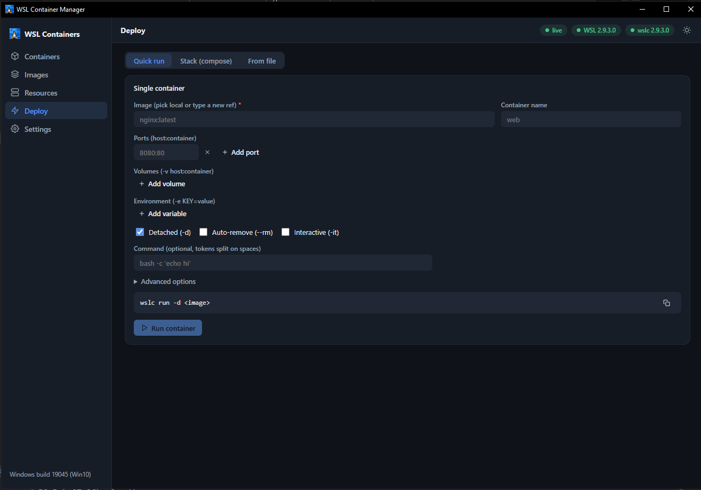

# 1. Installation

This tutorial takes you from nothing to a running WSL Container Manager window. It assumes
no prior knowledge of the project.

There are two ways in: **download a prebuilt executable** (fastest) or **build from
source**. Both are covered.

---

## Before you start

Check the three things the app needs.

### Windows version

Open PowerShell and run:

```powershell
[System.Environment]::OSVersion.Version
```

You need **build 19041 or newer**. Windows 11 is build 22000+.

The app runs fine on Windows 10 — it simply disables the `.wslconfig` keys that only
Windows 11 honours, and tells you why. You are not missing anything silently.

### WSL 2

```powershell
wsl --version
```

You should see a version block. If the command is not found, install WSL:

```powershell
wsl --install
```

Then reboot.

### `wslc` (optional, but it is the whole point)

`wslc.exe` is the WSL container CLI. It ships with **newer WSL releases only**.

```powershell
wslc version
```

- **You get a version** → the Containers, Images and Deploy pages will work.
- **"not recognized"** → your WSL is too old. Run `wsl --update` (add `--pre-release` if the
  stable channel still doesn't carry it). The app will still launch and the Resources and
  Settings pages work fully — the container pages show an honest "unavailable" state with a
  re-check button.

> `wslc.exe` lives at `C:\Program Files\WSL\wslc.exe`. That directory is added to `PATH` by the
> WSL installer, but **processes started before the update won't see the new `PATH`.** If
> `wslc version` fails in an old terminal, open a new one. The app itself handles this: it
> retries by absolute path before reporting `wslc` as absent.

### WebView2

Almost certainly already present — it ships with Microsoft Edge. If it isn't, the app
detects the failure, tells you, and opens itself in your default browser instead. Nothing
breaks.

---

## Option A — Download the executable

1. Go to the [Releases page](https://github.com/TykoDev/wslc-gui/releases) and download
   `wslc-gui.exe` from the newest release.

   (No release yet? Grab it from the artifacts of any green run of the
   [build workflow](https://github.com/TykoDev/wslc-gui/actions/workflows/build.yml).)

2. Put it wherever you like. It is self-contained — the whole SPA and server are compiled in.

3. **Optional but recommended — make it work offline.** Create a `dll/` folder next to the
   exe holding the two WebView2 DLLs:

   ```
   wslc-gui.exe
   dll/
   ├─ webview.dll
   └─ WebView2Loader.dll
   ```

   Both come from the [webview_deno 0.9.0 release](https://github.com/webview/webview_deno/releases/tag/0.9.0).

   Without `dll/`, the **first launch only** downloads those two files from GitHub. With it,
   the app never touches the network to start. See
   [Why the DLLs?](../concepts/architectural-overview.md#webview-dll-provisioning) if you
   want the reasoning.

4. Double-click `wslc-gui.exe`.

A 1280×800 window opens on the **Containers** page, and a tray icon appears.

---

## Option B — Build from source

You need [Deno 2.9+](https://deno.com/) and Git. Nothing else — no Node.js install, no npm.
Deno fetches the frontend toolchain itself.

```powershell
git clone https://github.com/TykoDev/wslc-gui.git
cd wslc-gui\app

deno task build:web    # Vite build → frontend/dist
deno task compile      # → dist/wslc-gui.exe
```

`deno task compile` produces a roughly 80 MB self-contained executable at
`app/dist/wslc-gui.exe`. Run it:

```powershell
.\dist\wslc-gui.exe
```

> **Build it in this order.** `compile` embeds `frontend/dist` into the exe. If you skip
> `build:web`, you compile an executable that serves a "Frontend bundle not found" page.

---

## Verify it works

When the window opens, look at the **top bar**. It is a live status readout:

| Pill | Meaning |
| --- | --- |
| `live` (green) | The SSE event stream is connected and pushing snapshots. |
| `WSL 2.x.x.x` | The detected WSL version. |
| `wslc 2.x.x.x` | `wslc` was found and probed. Container pages are live. |
| `wslc unavailable` | No `wslc` on this host. Resources and Settings still work. |
| `no session token` | Something is wrong — see below. |

Then:

**1. Go to Resources.** You should see your distributions, their real `ext4.vhdx` paths and sizes,
and your swap file. This page works with or without `wslc`.


**2. If you have `wslc`, go to Deploy → Quick run.** Type `nginx:latest`, add the port `8080:80`,
and watch the command preview assemble the exact line before you commit to it.



Press **Run container**, then check **Containers** — it should be there, with live CPU and memory.

---

## Command-line flags

| Flag | Effect |
| --- | --- |
| *(none)* | Opens the WebView2 window on an ephemeral port, plus a system-tray icon. |
| `--headless` | No window. Serves the UI on `127.0.0.1:8747` and prints a tokened URL for your browser. |

`--headless` is what development uses, and it is the automatic fallback if WebView2 fails to
load.

---

## The tray icon

While the app runs, a tray icon sits in the notification area (a Docker Desktop convention).

- **Double-click** → bring the window forward.
- **Minimize the window** → it hides to the tray rather than the taskbar.
- **Right-click** → `Open app` · `Stop WSL` · `Restart WSL` · `Quit app`.
- **Close the window with the X** → the tray icon is removed and the app exits.

`Stop WSL` runs `wsl --shutdown`. `Restart WSL` runs `wsl --shutdown` and then boots the
default distro back up. Both terminate every running distribution immediately.

---

## Troubleshooting

**"Could not start the wslc-gui server."**
Another copy is already running, or the port is taken. Close the other instance. (In window
mode the app binds an ephemeral port, so a genuine clash is rare — it is almost always a
second instance.)

**The window never appears, but a message box says it is opening in your browser.**
The WebView2 runtime could not be loaded. The app is still fully working — it just handed
you a browser URL instead. Install the
[WebView2 Evergreen Runtime](https://developer.microsoft.com/microsoft-edge/webview2/) to get
the native window back.

**`no session token` in the top bar.**
The SPA never received its token. In normal launches this cannot happen — the exe puts the
token in the URL fragment. It shows up if you navigate to `http://127.0.0.1:<port>/` by hand
without the `#t=…` fragment. Use the URL the app printed.

**The Containers page says WSL containers are not available.**
`wslc` is genuinely not on this host. Click **Re-check** after running `wsl --update` — the
capability probe is cached for 60 seconds, and that button forces a fresh one.

---

**Next:** [Configuration →](02-configuration.md)
