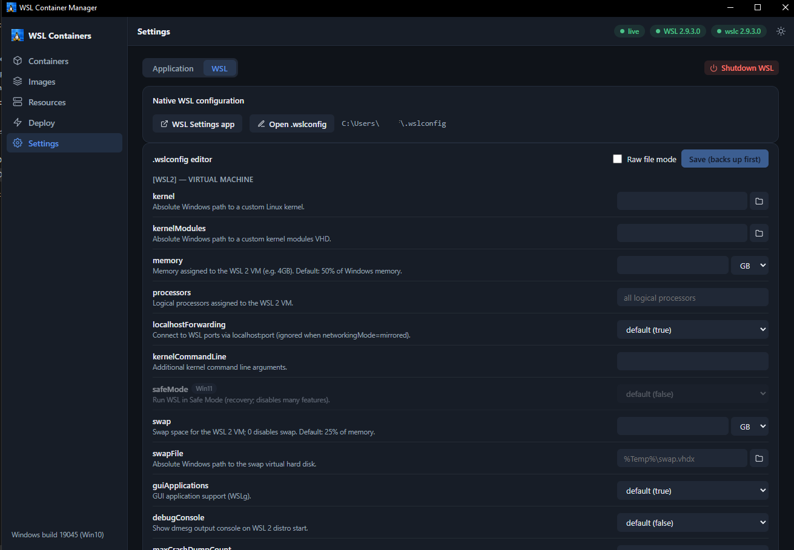

# 2. Configuration

There are two completely separate things called "configuration" here, and confusing them
will waste your afternoon:

| | **App settings** | **`.wslconfig`** |
| --- | --- | --- |
| Controls | The GUI itself (theme, refresh rate) | The WSL 2 virtual machine (memory, CPUs, networking) |
| Lives in | `%APPDATA%\wslc-gui\config.json` | `%USERPROFILE%\.wslconfig` |
| Owned by | This app | **WSL.** The app only edits it. |
| Takes effect | Immediately | Only after WSL restarts |
| Edited on | Settings → Application | Settings → WSL |

The app has **no `.env` file and no environment-variable configuration** for normal use.
Everything is either a GUI setting or a WSL setting. (A few environment variables exist for
debugging — see the [environment variables reference](../reference/environment-variables.md).)

---

## App settings

Open **Settings → Application**.

### Appearance

`System` (default) · `Light` · `Dark`.

`System` follows Windows' own light/dark preference and switches live when you change it.
The choice is stored server-side in `config.json`, so it survives restarts, and mirrored to
`localStorage` so the window doesn't flash the wrong theme while it boots.

### Behavior

**Container refresh interval** — how often the server re-runs `wslc container list` and
`wslc stats` and pushes a snapshot to the UI.

| Setting | Value written | Use when |
| --- | --- | --- |
| 2.5 s | `2500` (default) | Normal. Feels live. |
| 5 s | `5000` | You have many containers, or want less churn. |
| 10 s | `10000` | Long-running, mostly idle workloads. |

Changing this restarts the server's poller immediately. It does **not** affect the other
channels — Resources stays at 8 s, Images and Volumes at 30 s, capabilities at 60 s. Those
cadences are fixed.

**Show stopped containers by default** — whether the Containers page starts with the
`Show stopped` box ticked. Purely a starting position; you can always toggle it per-session.

### The file

`%APPDATA%\wslc-gui\config.json`:

```json
{
  "theme": "system",
  "pollMs": 2500,
  "showStoppedDefault": false
}
```

You can edit it by hand, but you do not need to. It is schema-validated on read: an
out-of-range `pollMs` (the valid range is 1000–60000) silently falls back to the default
rather than breaking, and a file that is not valid JSON at all is renamed to
`config.json.corrupt.<timestamp>` and regenerated. **The app will never crash-loop on a bad
config file.**

`%APPDATA%\wslc-gui\stacks.json` sits next to it and records what the Deploy page has
deployed. Same corruption handling.

---

## `.wslconfig` — the WSL 2 virtual machine

This file configures the VM that every WSL 2 distribution shares: how much memory it gets,
how many processors, how it does networking. It does not exist until something creates it.

Open **Settings → WSL**. You get three ways in, in increasing order of danger:

### 1. The native WSL Settings app

If your WSL release ships `wslsettings.exe`, the button launches it. This is Microsoft's own
editor. The button is disabled (with a reason) when the app isn't present on your host.

### 2. The guided editor (recommended)

The app renders the **full documented key catalog** as a form, split into `[wsl2]` (the
virtual machine) and `[experimental]` (preview features). Every key carries its description
and its default.



Three things this editor does that hand-editing does not:

**It gates Windows-11-only keys.** On Windows 10, keys like `safeMode`, `networkingMode`,
`firewall`, `dnsTunneling` and `nestedVirtualization` are shown but disabled, badged **`Win11`**,
with the title "Requires Windows 11 — this host is Windows 10." (You can see this in the
screenshot above — that's a Windows 10 build 19045 host.) They are not hidden; you can see what
you're missing.

**It writes the size grammar WSL actually honours.** This matters more than it sounds:

> `.wslconfig` sizes must be **a whole number with `MB` or `GB`** (`memory=4GB`), or a bare
> byte count (`defaultVhdSize=1099511627776`).
>
> **`memory=4G` is not documented, and WSL silently ignores the key** — falling back to its
> default of 50% of your RAM. No error, no warning. You just don't get what you asked for.

The size control emits `4GB`, never `4G`, and the server rejects the undocumented forms on
the structured-edit path. Decimals (`4.5GB`) are refused too — WSL doesn't take them.

If your file already contains a value the control cannot represent exactly (`50%`, an odd
byte count), the field degrades to a raw text box badged **"raw value"** and passes it
through character-for-character. **The editor never silently rewrites something it doesn't
understand.**

**It backs up before every write.** Saving creates `%USERPROFILE%\.wslconfig.bak.<timestamp>`
first, then writes to a temp file and atomically renames it over the real one — so a crash
mid-write cannot leave you with half a config. The five newest backups are kept; older ones
are rotated away.

The save is line-preserving: your comments, your blank lines and any keys the app has never
heard of all survive. Only the keys you actually edited are touched.

### 3. Raw file mode

A checkbox in the editor. You get a text area with the literal file contents and you own the
consequences — no catalog validation, no size-grammar guard. This is the escape hatch for
anything the form cannot express. The backup still happens.

### Making changes take effect

**`.wslconfig` changes do nothing until WSL restarts.** The app tells you this after every
save, and offers a **Shutdown WSL now** button.

That button runs `wsl --shutdown`, which **immediately terminates every running distribution.
Unsaved work inside them is lost.** It asks you to confirm, and lists what's running. WSL
restarts automatically the next time you use it.

(If you'd rather wait: WSL also shuts the VM down on its own after all distributions have
been idle for a while — the "8-second rule". Explicit shutdown is just faster and certain.)

---

## A minimal `.wslconfig` to start from

```ini
[wsl2]
memory=8GB
processors=4
swap=2GB

[experimental]
autoMemoryReclaim=gradual
sparseVhd=true
```

- `memory=8GB` — cap the VM at 8 GB instead of half your RAM.
- `processors=4` — four logical processors instead of all of them.
- `swap=2GB` — the swap VHD. `swap=0` disables swap entirely.
- `autoMemoryReclaim=gradual` — hand memory back to Windows as the VM goes idle.
- `sparseVhd=true` — new distro disks shrink when you delete things instead of only growing.

Every one of these keys is in the guided editor with its documented default. The full catalog
with types, defaults and Windows-version requirements is in the
[data model reference](../reference/data-model.md#wslconfig-key-catalog).

---

## Where everything lives

| Path | What |
| --- | --- |
| `%APPDATA%\wslc-gui\config.json` | App settings (theme, poll interval). |
| `%APPDATA%\wslc-gui\stacks.json` | Deployed-stack records. |
| `%USERPROFILE%\.wslconfig` | WSL 2 VM settings. |
| `%USERPROFILE%\.wslconfig.bak.<ts>` | Automatic backups (newest 5 kept). |
| `%LOCALAPPDATA%\wslc-gui\runtime\` | Working directory the exe uses for the WebView2 loader and the tray icon. |
| `%LOCALAPPDATA%\wslc\sessions\<name>\*.vhdx` | **WSL's own** container-session disks — where your images and containers actually live. The app reads these to total your container storage. It never writes here. |

---

**Next:** [Local development →](03-local-development.md)
