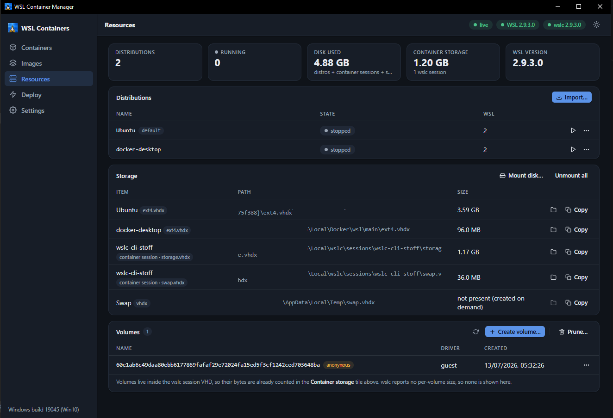

# WSL Container Manager (`wslc-gui`) — Documentation

A Docker-Desktop-style desktop app for Windows that puts the native `wsl.exe` and
`wslc.exe` command surface behind one GUI.

The guiding rule of this project: **it invents no commands.** Every button maps to a
CLI invocation that Microsoft documents (or that the installed `wslc` binary proves it
supports via `--help`). When the app cannot do something honestly, it says so rather
than faking it.

Ships as a single compiled Windows executable — Deno + React + WebView2, no runtime
dependencies beyond Windows' own WebView2.

---

## Start here

| If you want to… | Read |
| --- | --- |
| Install and launch the app | [Installation](getting-started/01-installation.md) |
| Understand `.wslconfig` and app settings | [Configuration](getting-started/02-configuration.md) |
| Build it from source and hack on it | [Local development](getting-started/03-local-development.md) |

## How-to guides (goal-oriented)

- [Build and release the executable](guides/deploying-to-production.md) — CI, tagging, the offline DLL layout.
- [Observe a running instance](guides/setting-up-monitoring.md) — SSE channels, live stats, capability probes, debugging a stuck UI.
- [Run the tests](guides/run-tests.md) — the 166-test suite, what each file covers, how to add to it.
- [Plan and land a change](guides/development-planning.md) — the bar a change has to clear here.

## Concepts (explanation)

- [Architectural overview](concepts/architectural-overview.md) — why the server lives in a Worker, what the capability model is for, how a stack becomes a sequence of `wslc run` calls.
- [Security model](concepts/security-model.md) — the trust boundaries, the token, the process-execution choke point, and the risks that were accepted rather than closed.

## Reference (look things up)

- [API endpoints](reference/api-endpoints.md) — every `/api` route, its body, and its status codes.
- [Data model](reference/data-model.md) — wire types, on-disk state, and the `.wslconfig` key catalog.
- [Environment variables](reference/environment-variables.md) — every variable the app reads or sets.
- [Commands & scripts](reference/commands-scripts.md) — every `deno task`, plus what CI runs.
- [Dependencies](reference/dependencies.md) — the full dependency tree and why each one is there.
- [Docker & Compose compatibility](reference/docker-reference.md) — the compose subset the app can execute, and exactly what it drops.

---

## What the app does

Five pages, each backed by real CLI calls:



- **Containers** — list (running/all), stop, start\*, delete\*, logs, inspect, exec, prune, and live `wslc stats`.
- **Images** — list, pull (explicit verb\* or the documented auto-pull fallback), inspect, delete\*, prune, plus tag discovery from Docker Hub and OCI v2 registries.
- **Resources** — distributions (terminate, start, set default/version, resize, sparse, move, export, import, install, unregister), storage (real `ext4.vhdx` paths and sizes read from the registry, container-session disks, swap), WSL platform versions, disk mount/unmount, and volumes\*.
- **Deploy** — Quick run (a `wslc run` configurator with a live command preview) and Stack mode: a compose-subset YAML the app compiles into an ordered `wslc run` plan, deploys sequentially, and exports as standard `docker-compose.yaml`. It also imports docker-compose and Kubernetes manifests, telling you item by item what it could not honour.
- **Settings** — theme, polling cadence, and a guided `.wslconfig` editor with the full documented key catalog, Windows-11-only keys gated on Windows 10, and backup-before-write.

\* **Capability-gated.** `container start`/`rm`, explicit `pull`, `image rm`, the `volume`
lifecycle and `run --entrypoint` are real in the WSL container API but are not documented
CLI verbs. The app enables them only when `wslc --help` on *your* host actually lists them.
On a host with no `wslc` at all, the Containers/Images/Deploy pages show an explicit
"unavailable" state and Resources/Settings stay fully functional.

## Requirements

- Windows 10 build 19041+ (some `.wslconfig` keys are Windows 11 only — annotated in-app).
- WSL 2. The container pages need a WSL release that ships `wslc`; on hosts without it the
  app degrades gracefully.
- WebView2 runtime (ships with Edge). If it is missing, the app falls back to `--headless`
  and opens in your browser.

## Project layout

```
wslc/
├─ app/              # the application (Deno backend + React frontend)
│  ├─ main.ts        # exe entrypoint: webview shell + server worker
│  ├─ adapter/       # the ONLY place a child process is spawned
│  ├─ server/        # HTTP server, routes, auth, SSE
│  ├─ stacks/        # compose-subset schema, importer, compiler, runner
│  ├─ system/        # native file/folder dialogs (Win32 FFI)
│  ├─ tray/          # system-tray worker (Win32 FFI)
│  ├─ frontend/      # React 19 + Vite 7 SPA
│  └─ tests/         # 166 unit tests
├─ docs/             # you are here
└─ .github/          # CI workflow + community health files
```
